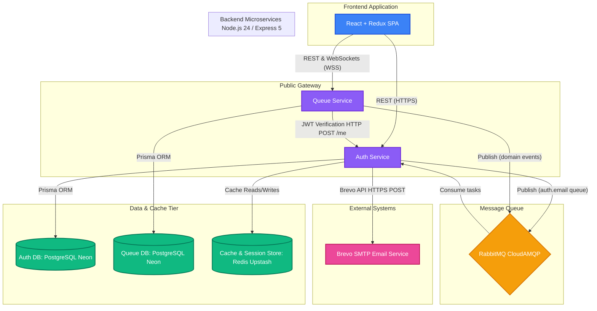
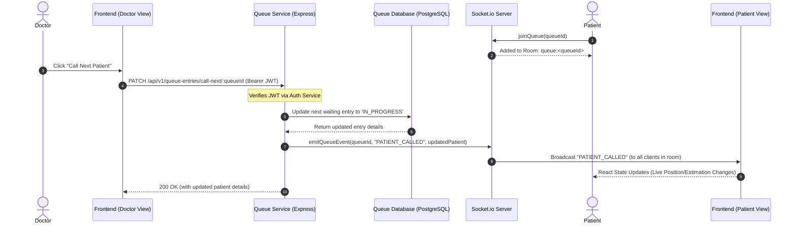
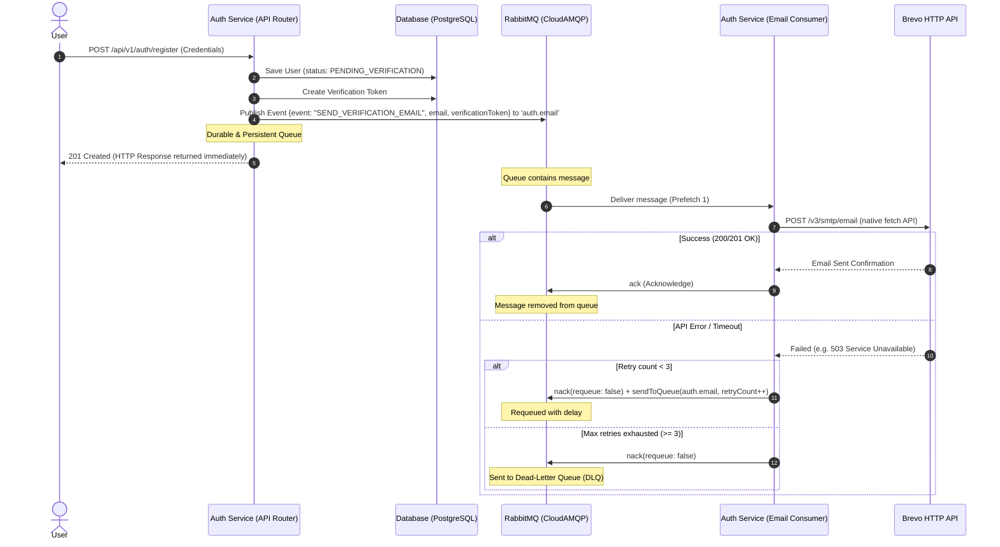
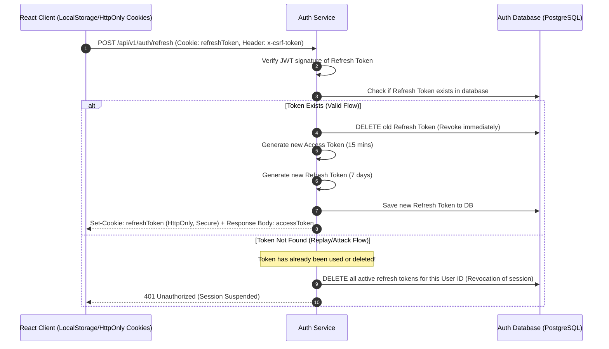

# Hospital Queue Management System - Architecture Overview

This document provides a comprehensive technical overview of the system's architecture, microservices, communication patterns, databases, security protocols, and integration points.

---

## 1. High-Level System Architecture

The application is structured as a decentralized, event-driven microservices architecture. It decouples the core domain responsibilities (Identity/Access vs. Queue Operations) into independent deployable units.

---

## 2. Visual Architecture Concept

Below is a generated visual concept mockup of the microservices system topology, showing the connection between the React Client, backend APIs, shared message queues, caching layers, and database clusters.

---

## 3. Microservice Specifications

### [Auth Service](file:///C:/Users/omkas/Desktop/placement/hospital%20Queue%20Management/Backend/auth-service)
- **Role**: Identity Provider & Session Manager.
- **Port**: `5001` (Dev) / `https://hospital-auth-service-yynk.onrender.com` (Prod)
- **Database**: Dedicated PostgreSQL database schema for User Credentials, Verification Tokens, Password Reset Tokens, and Audit Logs.
- **Cache**: Redis for tracking CSRF secret tokens and rate limiting metrics.
- **Email Handler**: Contains a RabbitMQ consumer task runner that pulls events from the `auth.email` queue and dispatches verification/reset emails using the Brevo HTTP API.

### [Queue Service](file:///C:/Users/omkas/Desktop/placement/hospital%20Queue%20Management/Backend/queue-service)
- **Role**: Hospital Queue and Patient Flow Management.
- **Port**: `5002` (Dev) / `https://hospital-queue-service.onrender.com` (Prod)
- **Database**: Dedicated PostgreSQL database schema for Hospitals, Departments, Doctors, Queues, and Queue Entries.
- **WebSockets**: Hosts the Socket.io server to push live queue updates directly to patient dashboards.
- **Security Check**: For all protected API endpoints, it behaves as a Resource Server that verifies JWT tokens via internal REST calls back to Auth Service's `/me` endpoint.

---

## 4. Key Architectural Flows

### A. Real-time Patient Queue Updates

The client connects to Socket.io hosted on the Queue Service, joining a specific room matching the queue identifier. Actions taken by doctors or receptionists broadcast events to all users in the room.

---

### B. Asynchronous Email Dispatch (RabbitMQ)

To avoid blocking HTTP responses on slow external SMTP or mail API operations, the Auth Service utilizes an event-driven publisher-consumer model.

---

### C. Authentication and Token Rotation Lifecycle

Security is reinforced via **Refresh Token Rotation (RTR)**. Every time an access token is refreshed, the old refresh token is deleted, and a new key pair is generated.

---

## 5. Security & Isolation Matrix

| Component | Security Feature | Implementation Details |
|---|---|---|
| **CORS Policy** | Whitelisted Origins | Restricted to client URL `hospital-queue-management-eosin.vercel.app` and `localhost:5173`. |
| **Storage Security** | HttpOnly Cookies | Refresh tokens are stored strictly inside HttpOnly cookies with `Secure`, `SameSite=None/Lax` flags, avoiding Javascript access (XSS mitigation). |
| **CSRF Defense** | double-submit token | State-changing endpoints (`/refresh`, `/logout`) require an `x-csrf-token` header, verified against a Redis-cached secret. |
| **Microservice Auth** | Inter-service JWT | Queue Service makes a backend request `/me` to the Auth service passing the Bearer token to authorize patient/doctor credentials. |
| **API Protection** | Express Rate Limiting | Implemented on registration and login endpoints to safeguard against credential stuffing. |
| **HTTP Security Headers** | Helmet.js | Applies HTTP headers to avoid standard clickjacking, MIME sniffing, and scripting vulnerabilities. |

---

## 6. Infrastructure & Deployment Setup

- **Frontend Hosting**: Deployed to Vercel with automatic builds triggered on pushing to the `main` branch.
- **Backend API Hosting**: Auth Service and Queue Service are hosted as web services on Render.
- **Relational Storage**: Dual PostgreSQL instances hosted on serverless Neon Postgres.
- **Caching & Brokerage**:
  - Redis instances run on Upstash.
  - RabbitMQ AMQP message broker hosted on CloudAMQP.
